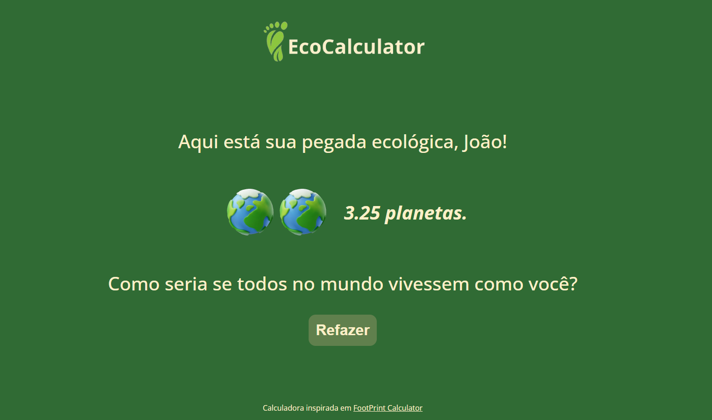

## Capacitação de Professores: Fundamentos de Tecnologias Web
# Descrição
Este repositório contém o projeto final da capacitação de professores da rede pública de ensino de Apucarana-PR e região, realizada com o objetivo de introduzir os conceitos básicos de desenvolvimento web (HTML, CSS e JavaScript). O projeto consiste em uma calculadora de pegada ecológica, inspirada na calculadora oficial do Footprint, que permite aos usuários estimarem seu impacto ambiental.
# Objetivos
- Introduzir os conceitos fundamentais de desenvolvimento web (HTML, CSS, JavaScript).
- Desenvolver habilidades práticas para criação de páginas web simples e interativas.
- Inspirar professores a integrar tecnologias digitais em suas aulas.

# Calculadora de Pegada Ecológica
A calculadora de pegada ecológica é uma ferramenta interativa que permite aos usuários estimar seu impacto ambiental. Ela foi inspirada na calculadora oficial do Footprint e utiliza uma forma mais simplificada de cálculo. Ao final, a calculadora retornará uma quantidade de planetas. Esse número indica quantos planetas seriam necessários para sustentar a vida na Terra se todas as pessoas tivessem o mesmo estilo de vida que você.

**Site da calculadora oficial:**  [_Footprint_](https://www.footprintcalculator.org/home)

# Como usar
1. **Acesse o arquivo:** Abra o arquivo index.html em qualquer navegador.
2. **Responda às perguntas:** Siga as instruções na tela para responder às perguntas sobre seus hábitos de consumo.
3. **Veja o resultado:** Ao final, a calculadora mostrará sua pegada ecológica estimada.
# Tecnologias utilizadas
- **HTML:** Estrutura da página.
- **CSS:** Estilização da página.
- **JavaScript:** Interatividade e cálculos.
# Agradecimentos
Agradecemos a todos os professores que participaram da capacitação, à UTFPR e ao NRE Apucarana pela parceria e apoio.

